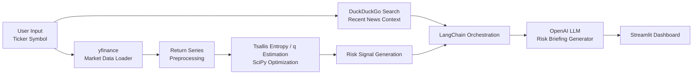

## 📈 Quantamental Risk Dashboard

<p align="center">
  <b>Tsallis Entropy × LLM × Real-time Web Search</b><br>
  극단적 시장 위험(Fat-tail Risk)과 투자자 군집 행동(Herd Behavior)을 분석하는 인터랙티브 리스크 대시보드
</p>

<p align="center">
  
  
  
  
  
  
</p>

---

## ✨ Overview

**Quantamental Risk Dashboard**는 통계물리학의 **Tsallis Entropy** 모델, **대규모 언어 모델(LLM)**, 그리고 **실시간 웹 검색**을 결합하여 주식 시장의 비정상적 변동성과 군집 행동을 해석하는 프로젝트입니다.

이 대시보드는 단순히 가격 차트를 보여주는 데 그치지 않고,

- 시장이 **정상 상태인지**, 아니면 **극단적 충격에 취약한 상태인지**를 수치화하고
- 최신 뉴스와 이벤트를 검색하여
- 그 위험 신호의 **현실적 배경**까지 자연어로 설명합니다.

즉, **수학적 이상 징후 탐지**와 **AI 기반 해석**을 하나로 연결한 리스크 분석 도구입니다.

---

## 🧠 Why This Project Matters

기존의 시장 분석 도구는 보통 다음 둘 중 하나에 집중합니다.

1. **가격과 거래량 같은 수치 데이터 분석**
2. **뉴스와 리포트 같은 텍스트 정보 분석**

하지만 실제 시장은 이 둘이 동시에 작동합니다.

> 숫자는 "위험이 커지고 있다"고 말하고,
> 뉴스는 "왜 그런 일이 벌어지고 있는지"를 설명합니다.

이 프로젝트는 그 사이를 연결합니다.

- **Tsallis Entropy** → 시장의 불안정성과 fat-tail 위험 측정
- **LangChain + Web Search** → 최근 이슈와 뉴스 수집
- **LLM** → 정량 신호와 정성 정보를 종합한 리스크 브리핑 생성

---

## 🗂️ Table of Contents

- [✨ Overview](#-overview)
- [🧠 Why This Project Matters](#-why-this-project-matters)
- [📊 Core Model Explained](#-core-model-explained)
- [🚀 Key Features](#-key-features)
- [🖼️ Dashboard Preview](#️-dashboard-preview)
- [🏗️ System Architecture](#️-system-architecture)
- [📁 Project Structure](#-project-structure)
- [📋 Prerequisites](#-prerequisites)
- [⚙️ Installation](#️-installation)
- [▶️ Run the App](#️-run-the-app)
- [💡 Usage Guide](#-usage-guide)
- [🛠️ Tech Stack](#️-tech-stack)
- [📌 Future Improvements](#-future-improvements)
- [⚠️ Disclaimer](#️-disclaimer)
- [📄 License](#-license)

---

## 📊 Core Model Explained

이 프로젝트의 핵심은 **“시장이 얼마나 위험한 상태인가?”**를 정량적으로 측정하는 데 있습니다.

### 1) Tsallis Entropy란?

쉽게 말하면, 시장의 **무질서도**와 **쏠림 현상**을 반영하는 물리학 기반 지표입니다.

- **정상적인 시장**에서는 투자자들이 비교적 독립적으로 움직입니다.
- **위험한 시장**에서는 공포나 탐욕이 전염되듯 퍼지며, 많은 투자자가 같은 방향으로 몰립니다.
- 이때 시장은 정규분포보다 훨씬 더 큰 폭의 급등·급락을 보이게 되는데, 이를 **fat-tail** 현상이라고 합니다.

Tsallis Entropy는 이런 비정상적 움직임을 포착하는 데 유용합니다.

### 2) Tsallis 지수 \(q\)의 의미

대시보드에서 가장 중요한 수치입니다.

- **q ≈ 1**
  - 비교적 안정적인 시장
  - 큰 충격이 발생할 가능성이 낮음
- **q가 커질수록**
  - 분포의 꼬리가 두꺼워짐
  - 급등·급락 가능성이 높아짐
  - 투자자 군집 행동이 강화되었을 가능성 시사

즉, **q 값이 상승한다는 것은 시장의 ‘평소 같지 않음’이 커지고 있다는 신호**로 해석할 수 있습니다.

### 3) LLM과 검색 엔진은 왜 필요한가?

수학 모델은 위험의 **존재**를 감지할 수는 있지만, 위험의 **원인**은 설명하지 못합니다.

예를 들어,

- q 값은 급등했지만
- 그 이유가 금리 발언인지,
- 지정학적 충돌인지,
- 실적 발표 충격인지

모델만으로는 알기 어렵습니다.

그래서 이 프로젝트는 다음 흐름으로 작동합니다.

1. 주가 데이터를 수집하고 수익률 분포를 계산
2. Tsallis 기반 위험 지표를 추정
3. 관련 종목/시장 뉴스 검색
4. LLM이 수치 + 뉴스 컨텍스트를 종합하여 브리핑 생성

결과적으로 사용자는 단순한 숫자가 아니라,
**“지금 왜 위험한가?”**까지 함께 이해할 수 있습니다.

---

## 🚀 Key Features

- **실시간 시장 데이터 수집**  
  `yfinance`를 통해 입력한 티커의 최신 가격 데이터를 불러옵니다.

- **Tsallis 파라미터 최적화**  
  `scipy.optimize`를 사용하여 수익률 분포에 가장 잘 맞는 위험 파라미터를 추정합니다.

- **Fat-tail Risk 탐지**  
  일반적인 정규분포 가정으로 놓치기 쉬운 극단적 변동 가능성을 포착합니다.

- **실시간 뉴스 탐색**  
  DuckDuckGo 기반 검색을 통해 최근 시장 이슈와 변동 요인을 수집합니다.

- **AI 리스크 브리핑**  
  정량 지표와 뉴스 컨텍스트를 결합해 자연어 기반의 요약 리포트를 생성합니다.

- **인터랙티브 대시보드**  
  Streamlit 기반 UI로 누구나 쉽게 분석 결과를 탐색할 수 있습니다.

---


## 🏗️ System Architecture



### 분석 흐름 요약

- **시장 데이터 수집** → 가격/수익률 계산
- **위험 파라미터 추정** → fat-tail 성향 분석
- **뉴스 검색** → 원인 후보 수집
- **LLM 브리핑 생성** → 사람 친화적 설명 제공
- **대시보드 시각화** → 사용자에게 결과 전달

---

## 📁 Project Structure

## 📂 프로젝트 구조
```text
nasdaq_risk_bot/
│
├── .env               # API 키 보관 (Git 업로드 제외 필수)
├── config.py          # 환경 변수 및 분석 파라미터 설정
├── math_engine.py     # 살리스 엔트로피 및 q-Gaussian 수학 연산 모듈
├── data_loader.py     # 시장 데이터 수집 및 전처리 모듈
└── app2.py             # Streamlit UI 및 LangChain 실행 메인 파일

---

## 📋 Prerequisites

프로젝트 실행 전 아래 항목이 준비되어 있어야 합니다.

- **OS:** Windows / macOS / Linux
- **Python:** 3.8 이상 권장, **3.10+ 추천**
- **OpenAI API Key**
- **인터넷 연결**
  - 주가 데이터 다운로드
  - 뉴스 검색
  - LLM API 호출

---
```
## ⚙️ Installation

### 1. Clone the repository

```bash
git clone https://github.com/your-username/quantamental-risk-dashboard.git
cd quantamental-risk-dashboard
```

### 2. Install dependencies

```bash
pip install streamlit plotly pandas numpy yfinance scipy python-dotenv openai langchain langchain-openai langchain-community duckduckgo-search requests streamlit-searchbox
```

또는 `requirements.txt`가 있다면:

```bash
pip install -r requirements.txt
```

### 3. Set environment variables

프로젝트 루트에 `.env` 파일을 생성한 뒤 아래처럼 입력합니다.

```env
OPENAI_API_KEY=sk-your-openai-api-key
```

---

## ▶️ Run the App

```bash
streamlit run app.py
```

실행 후 브라우저에서 아래 주소로 접속합니다.

```text
http://localhost:8501
```

---

## 💡 Usage Guide

1. 사이드바에 분석할 **티커 심볼**을 입력합니다.  
   예: `SPY`, `QQQ`, `AAPL`, `TSLA`

2. **분석 실행 버튼**을 클릭합니다.

3. 상단 요약 카드에서 다음 정보를 확인합니다.
   - 현재 가격
   - Tsallis 지수 \(q\)
   - 위험 상태 요약

4. 차트 영역에서 가격 흐름과 변동 양상을 확인합니다.

5. 뉴스 컨텍스트 섹션에서 최근 시장 이벤트를 확인합니다.

6. 마지막으로 **AI 리스크 브리핑**을 통해 정량 + 정성 분석 결과를 종합적으로 해석합니다.

---

## 🛠️ Tech Stack

| Category | Tools |
|---|---|
| Language | Python 3.10+ |
| Frontend | Streamlit |
| Data Processing | Pandas, NumPy |
| Optimization / Math | SciPy |
| Financial Data | yfinance |
| Web Search | DuckDuckGo Search |
| LLM / Orchestration | OpenAI API, LangChain |
| Visualization | Matplotlib |

---

## 📌 Future Improvements

- VIX, 금리, 환율 등 **거시지표 연동**
- 종목 단위가 아닌 **섹터/지수 단위 위험 분석**
- q 값 변화 기반의 **리스크 경고 알림 기능**
- **백테스트 기능** 추가
- Plotly 기반의 더 풍부한 인터랙션 지원
- 뉴스 감성 분석과 결합한 **멀티모달 리스크 해석**

---

## ⚠️ Disclaimer

이 프로젝트는 **연구 및 학습 목적**으로 제작되었습니다.

- 본 대시보드는 투자 조언을 제공하지 않습니다.
- 생성된 브리핑은 참고용 해석이며, 실제 투자 판단의 근거로 단독 사용해서는 안 됩니다.
- 금융시장 데이터와 뉴스는 지연, 누락, 오류가 있을 수 있습니다.

---

## 📄 License
This project is licensed under the MIT License - see the [LICENSE](LICENSE) file for details.

---

## 🙌 Contact

프로젝트에 관심이 있거나 협업을 원하신다면 Issues 또는 Pull Request로 언제든지 의견을 남겨 주세요.